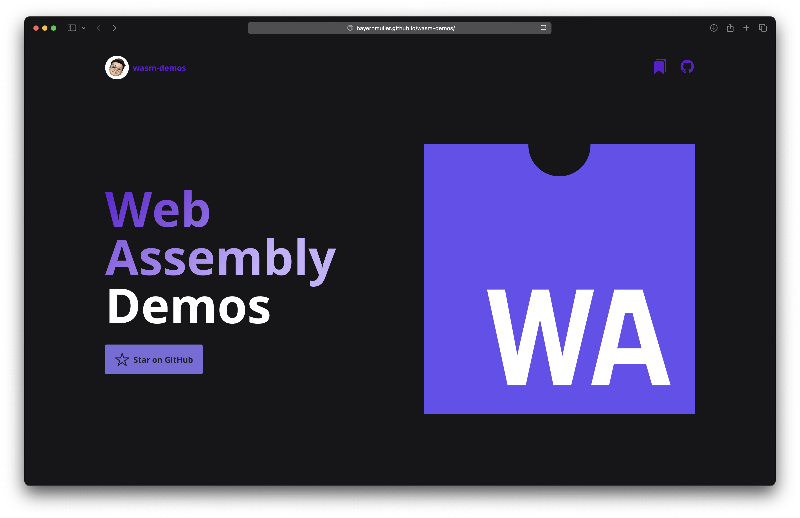

    
     
    

# wasm-demos

<a href="https://bayernmuller.github.io/wasm-demos/">https://bayernmuller.github.io/wasm-demos/</a>

    
    
    

### Overview
* **wasm-demos** is a collection of demos for WebAssembly.
* It includes demos for music recognition, image processing, and other applications.

### Demos
* *TODO: Add demos here*

### Building the WebAssembly Modules
* *TODO: Add instructions here*

### License
* wasm-demos is licensed under the MIT license. See [LICENSE](LICENSE) for more details.